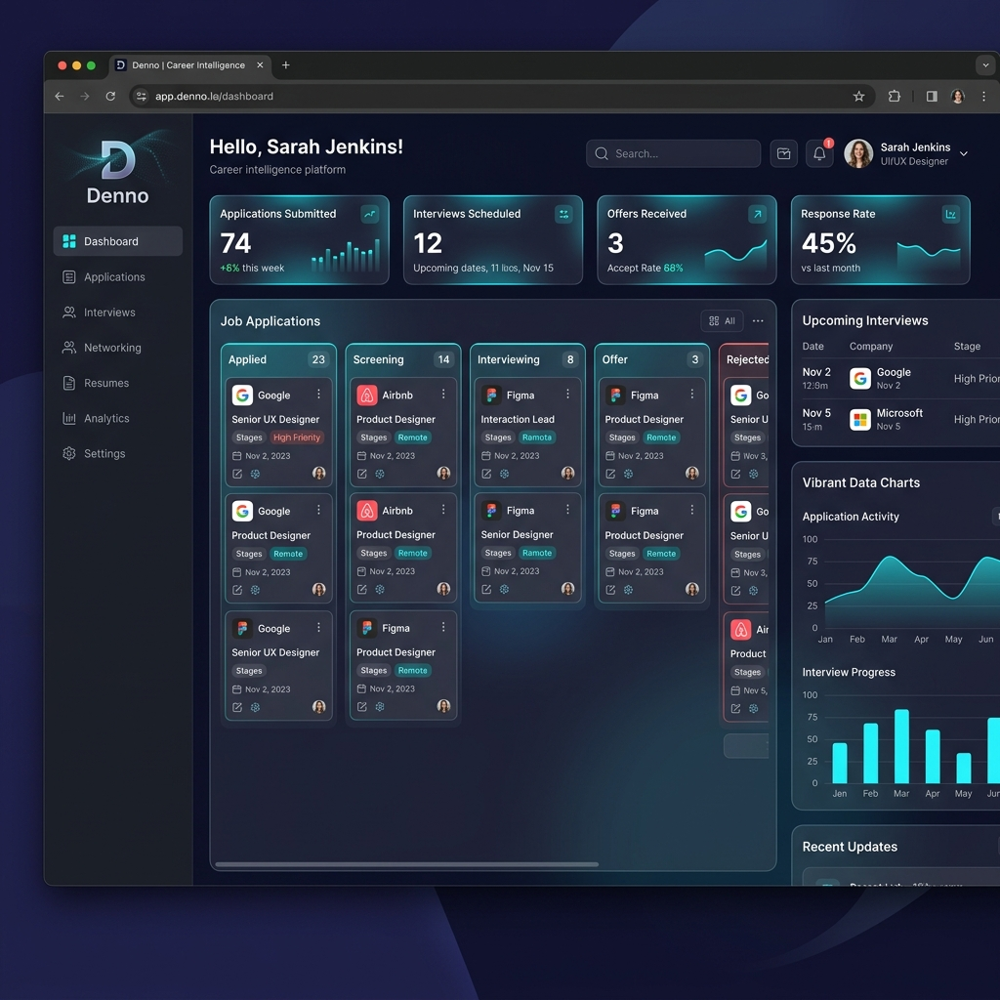
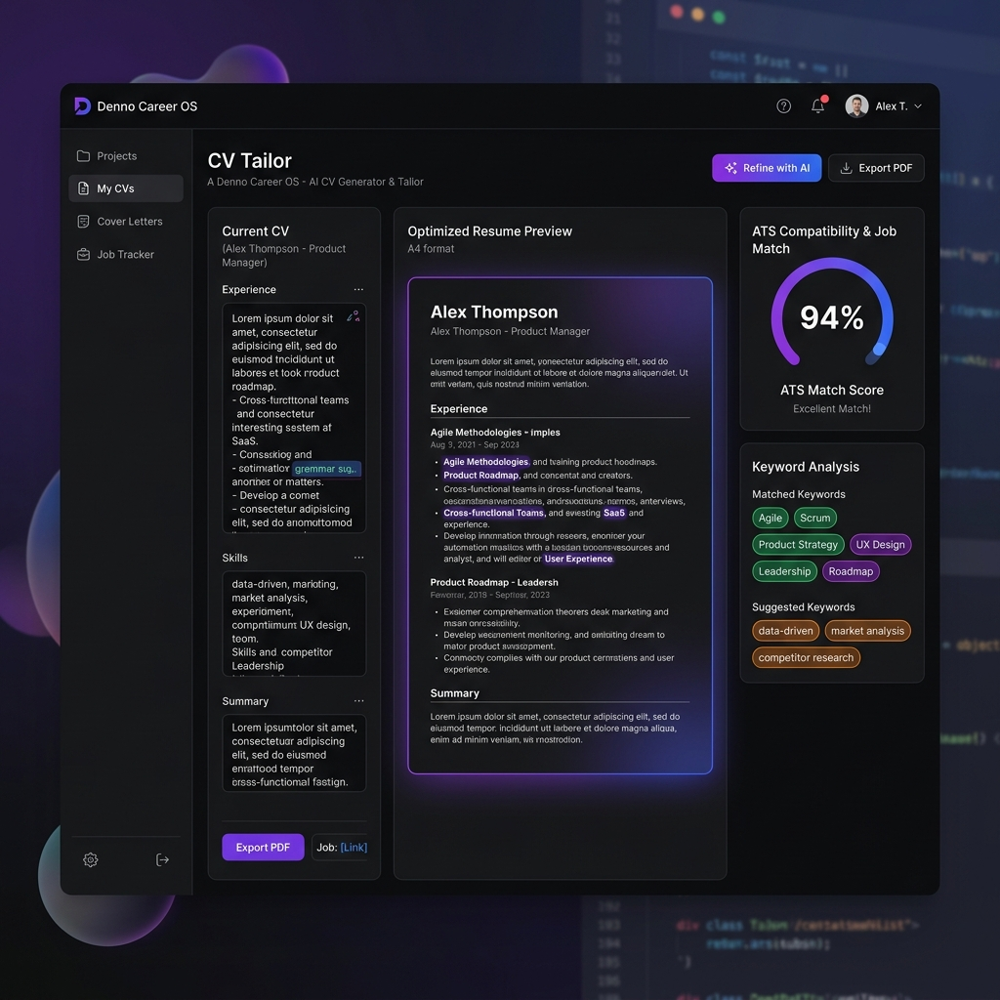
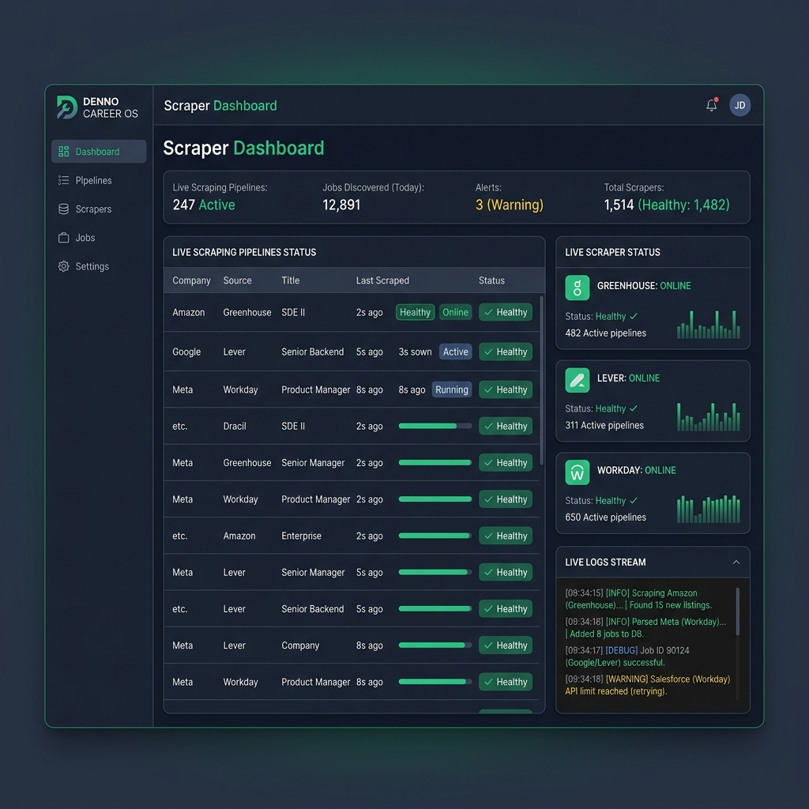
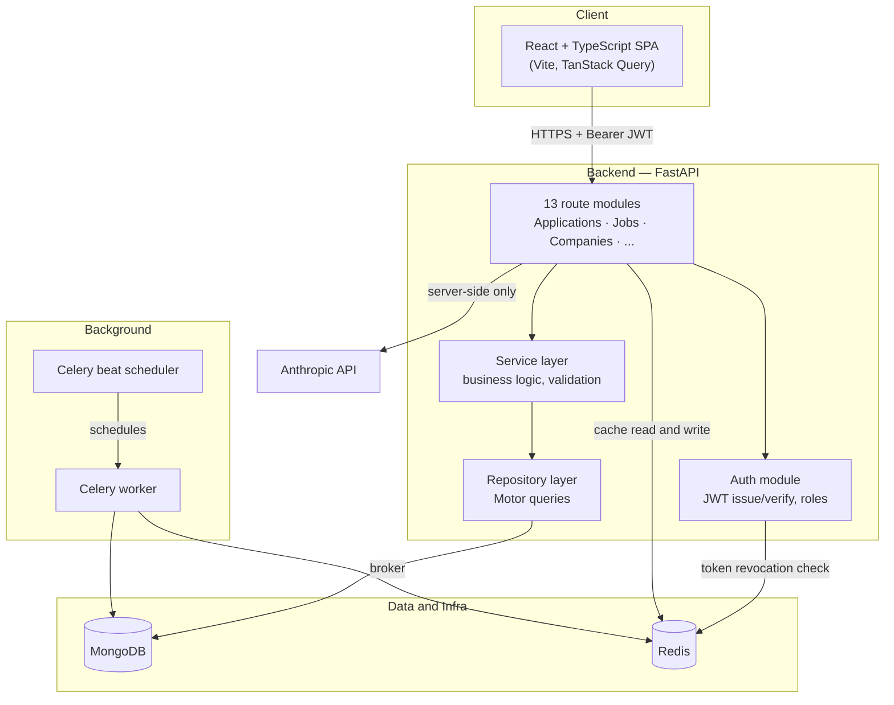

<div align="center">


<br/>

**Plan. Learn. Apply. Track. Grow.**
<br/>
One platform for the entire job-search and career-development lifecycle.

<br/>


</div>

---

> **Documentation map** — this file is the project overview and quick start.
> For deeper reference, see:
> - [`docs/ARCHITECTURE.md`](docs/ARCHITECTURE.md) — system design, diagrams, deployment topology
> - [`docs/DEPLOYMENT.md`](docs/DEPLOYMENT.md) — production setup, Docker Compose, SSL, backups & cloud hosting
> - [`docs/GITHUB_AND_VERCEL_DEPLOYMENT.md`](docs/GITHUB_AND_VERCEL_DEPLOYMENT.md) — GitHub & Vercel step-by-step deployment guide
> - [`docs/API.md`](docs/API.md) — full endpoint reference, one table per module
> - [`database/SCHEMA.md`](database/SCHEMA.md) — MongoDB collection schemas, ER diagram, indexes

## Table of Contents

- [What is Denno?](#what-is-denno)
- [Screenshots](#screenshots)
- [Features](#features)
- [Tech Stack](#tech-stack)
- [Architecture at a Glance](#architecture-at-a-glance)
- [Quick Start](#quick-start)
- [Project Structure](#project-structure)
- [Environment Variables](#environment-variables)
- [Available Scripts](#available-scripts)
- [Testing & CI](#testing--ci)
- [Verification Status](#verification-status)
- [Roadmap](#roadmap)
- [Contributing](#contributing)
- [License](#license)

## What is Denno?

Denno centralizes the entire job-search workflow — job discovery, applications,
CVs, interviews, learning, networking, and career analytics — into one system,
instead of spreading it across Gmail, LinkedIn, spreadsheets, and a dozen
browser tabs.

This repository contains a working full-stack build: a FastAPI + PostgreSQL (with auto SQLite fallback) backend across 14 modules, a React + TypeScript frontend, and the supporting
infrastructure (Redis caching, Celery background jobs, seed data, and a test suite).

"## Screenshots

<div align="center">





*Denno Career OS Platform Interface — Dashboard, AI CV Tailor, and Scraper Engine Control Panel.*

</div>"

## Features

| Area | What it does | Status |
|---|---|---|
| **Applications** | 13-stage pipeline (Saved → Applied → Interview → Offer), analytics aggregation | ✅ Full stack |
| **Jobs** | Search/filter feed, one-click "Apply" that creates a tracked Application | ✅ Full stack |
| **Companies** | Searchable directory, sector filter, admin-managed catalog | ✅ Full stack |
| **Job Sources** | Per-company scrape-status monitor, scheduled re-verification | ✅ Full stack |
| **Emails** | Inbox with category classification, read/unread state | ✅ Full stack |
| **CV Manager** | Multiple tailored versions, ATS score, usage tracking | ✅ Full stack |
| **Learning** | Shared course catalog + per-user progress tracking | ✅ Full stack |
| **Interviews** | Prep checklists, behavioral/technical question banks, outcomes | ✅ Full stack |
| **Calendar** | Interviews, deadlines, reminders by month | ✅ Full stack |
| **Goals** | Progress targets with increment controls | ✅ Full stack |
| **Knowledge Base** | Tagged, searchable notes | ✅ Full stack |
| **Networking** | Recruiter contacts with relationship-strength tracking | ✅ Full stack |
| **Export / Import** | JSON & CSV, both directions, per-row error reporting | ✅ Full stack |
| **Auth** | JWT (access + refresh), roles, logout revocation, password reset (frontend + backend) | ✅ Full stack |
| **AI Assistant (Denno1)** | Floating chat widget + Cover Letter Generator page, server-proxied to Claude | ✅ Full stack |
| **Gmail / LinkedIn sync** | Auto-classify emails, import profile data | 🚧 Not started |

## Tech Stack

| Layer | Technology |
|---|---|
| Frontend | React 18, TypeScript, Vite, Tailwind CSS, TanStack Query, React Router |
| Backend | Python 3.12, FastAPI, Pydantic v2 |
| Database | Async SQLAlchemy (PostgreSQL / SQLite fallback) + Motor MongoDB indexes |
| Cache / Broker | Redis |
| Background jobs | Celery (worker + beat scheduler) |
| Auth | JWT (python-jose), bcrypt (passlib) |
| AI | Anthropic API (server-side proxy only — key never reaches the browser) |
| Testing | pytest, pytest-asyncio, esbuild (frontend syntax checks) |
| Background jobs | Celery worker + beat |
| Local services | Redis and MongoDB |

## Architecture at a Glance



See [`docs/ARCHITECTURE.md`](docs/ARCHITECTURE.md) for the request-lifecycle
sequence diagrams (auth flow, one-click apply) and deployment topology.

## Quick Start

```bash
# 1. Clone and configure
git clone <this-repo>
cd denno
cp .env.example .env

# 2. Start the local services and app
#    Use your preferred local setup for MongoDB, Redis, and the backend/frontend processes.

# 3. Seed reference data (companies -> jobs -> sources, in that order)
python scripts/seed_companies.py
python scripts/seed_jobs.py
python scripts/seed_job_sources.py

# 4. Open the app
#    Frontend:  http://localhost:5173
#    API docs:  http://localhost:8000/docs
#    Register an account in the UI, then optionally:
python scripts/promote_admin.py you@example.com   # unlocks admin-only writes
```

## Project Structure

```
denno/
├── backend/
│   ├── app/
│   │   ├── api/            # 15 route modules (one folder per resource)
│   │   ├── core/            # config, security, redis, celery, deps
│   │   ├── database/        # Mongo connection + index definitions
│   │   ├── models/           # Mongo document shapes (Pydantic)
│   │   ├── schemas/          # API request/response shapes
│   │   ├── repositories/     # Motor queries -- the only DB-touching layer
│   │   ├── services/         # business logic between routes and repos
│   │   └── tasks/            # Celery background jobs
│   ├── tests/                 # pytest suite
│   └── requirements*.txt
├── frontend/
│   └── src/
│       ├── pages/             # one folder per module, full CRUD UI
│       ├── services/           # HTTP calls, one file per resource
│       ├── hooks/               # TanStack Query hooks
│       ├── types/                # TypeScript interfaces matching backend schemas
│       └── routes/                # layout + auth guard
├── database/
│   └── SCHEMA.md               # full MongoDB collection reference
├── docs/
│   ├── ARCHITECTURE.md
│   └── API.md
├── scripts/                     # seed data, admin promotion, static wiring checker
└── data/
```

## Environment Variables

All variables live in `.env` (copy from `.env.example`).

| Variable | Purpose | Default (dev) |
|---|---|---|
| `MONGO_ROOT_USERNAME` | MongoDB root user | `(set a strong local username)` |
| `MONGO_ROOT_PASSWORD` | MongoDB root password | `(set a strong local password; rotate before production)` |
| `MONGO_URI` | Full connection string with auth | `mongodb://<username>:<password>@localhost:27017/?authSource=admin` |
| `MONGO_DB_NAME` | Database name | `denno` |
| `REDIS_URL` | Redis connection string | `redis://localhost:6379/0` |
| `JWT_SECRET` | Signs all issued tokens | *(set a long random value)* |
| `JWT_ALGORITHM` | JWT signing algorithm | `HS256` |
| `ACCESS_TOKEN_EXPIRE_MINUTES` | Access token lifetime | `60` |
| `REFRESH_TOKEN_EXPIRE_DAYS` | Refresh token lifetime | `30` |
| `ANTHROPIC_API_KEY` | Powers the AI proxy (`/ai/*`) | *(required only for AI features)* |
| `FRONTEND_ORIGIN` | CORS allow-list | `http://localhost:5173` |
| `VITE_API_URL` (frontend) | Backend base URL | `http://localhost:8000/api/v1` |

## Available Scripts

| Script | What it does |
|---|---|
| `scripts/seed_companies.py` | Seeds 130 companies |
| `scripts/seed_jobs.py` | Seeds 33 jobs, cross-referenced to seeded companies |
| `scripts/seed_job_sources.py` | Seeds one Source Monitor entry per company |
| `scripts/promote_admin.py <email>` | Grants a registered user the `admin` role (DB-direct, not an HTTP endpoint by design) |
| `scripts/check_wiring.py` | Static check: every route → service → repository call resolves to a real method |

## Testing & CI

```bash
cd backend
pip install -r requirements.txt -r requirements-dev.txt
pytest -v
```

The repo now relies on local development setup instead of a hosted CI workflow.
frontend type-check + build on every push. See
[Verification Status](#verification-status) for exactly what has and hasn't
been executed so far, and why.

## Verification Status

This project was built in a sandboxed environment with **no network access**
— `pip`/`npm` package installation was not possible, so nothing here has
been booted against a live server. Being precise about what that does and
doesn't mean:

| Check | Method | Result |
|---|---|---|
| Backend syntax (104 files) | `python3 -m py_compile` | ✅ All valid |
| Backend wiring (route→service→repo) | Custom static call-graph checker | ✅ 14 services, 14 repositories, 15 routes, 0 broken calls |
| Frontend syntax (59 files) | esbuild parse | ✅ All valid |
| Seed data integrity | AST cross-reference checks | ✅ 130 companies, 33 jobs, all references resolve |
| Pure algorithm logic (CSV parsing, rate math, clamping) | Extracted and *actually executed* outside the sandbox's missing dependencies | ✅ Verified — caught and fixed one real test bug in the process |
| Full pytest suite | Not run — `pytest`/`fastapi`/`motor` not installable here | ⏳ Runs for real in CI |
| Live server boot | Not run — no network to install dependencies | ⏳ Run the backend/frontend locally to verify |

## Roadmap

| Priority | Item |
|---|---|
| High | Run this against a real Mongo/Redis instance for the first time (integration test) |
| Medium | Gmail/LinkedIn OAuth integration |
| Medium | Real job-source scraping (currently `/job-sources/verify` is simulated) |
| Medium | Object storage (S3/MinIO) for actual CV/document file uploads |
| Low | Notifications module, real-time updates |
| Low | Admin management UI for Companies/Jobs (backend supports it; only read-only pages exist) |

## Session 4: End-to-end wiring audit

Rather than add more features, this pass cross-referenced every frontend
API call against the actual backend route it's supposed to hit — by
grepping both sides and diffing, not by assuming the earlier build was
correct. Found and fixed four real gaps:

1. **Admin-guard bypass**: `POST /companies` and `POST /jobs` require
   `role: admin`, but CSV/JSON import called `CompanyService.create()` /
   `JobService.create()` directly — skipping the route-level guard
   entirely, since it's a different code path. Any authenticated user
   could have bulk-imported companies/jobs via CSV. Fixed by checking
   role explicitly inside the import flow for public-resource imports.
2. **`CurrentUser` type missing `role`**: the frontend had no way to know
   if the logged-in user was an admin, even though the backend's
   `/auth/me` always returned it. Fixed, plus added `useCurrentUser()` /
   `useIsAdmin()` hooks so future admin-gated UI has something to check.
3. **AI proxy endpoints (`/ai/cover-letter`, `/ai/denno1`) had zero
   frontend wiring** — the biggest functional gap. Added a Cover Letter
   Generator page and a floating Denno1 chat widget (mounted globally in
   `AppLayout`), both calling the real backend proxy. Verified the exact
   endpoint paths match on both sides (`grep`-extracted from both files,
   not eyeballed).
4. **Password reset had a backend but no frontend** — added forgot/reset
   flows to the login page.

Final counts after this pass: 111 backend files, 64 frontend files (was
59), all passing `py_compile`/esbuild/`check_wiring.py`/`check_docs.py`.

## Contributing

1. Follow the existing layered pattern for any new module: `models/` →
   `schemas/` → `repositories/` → `services/` → `api/<module>/routes.py`.
2. Run `python scripts/check_wiring.py` before committing — it catches
   route→service→repository name mismatches before they reach review.
3. Add tests under `backend/tests/`; prefer pure-logic tests where possible
   (see `test_data_transfer_service.py` for the pattern).

## License

Not yet licensed for external use — add a `LICENSE` file before publishing
this repository publicly.
