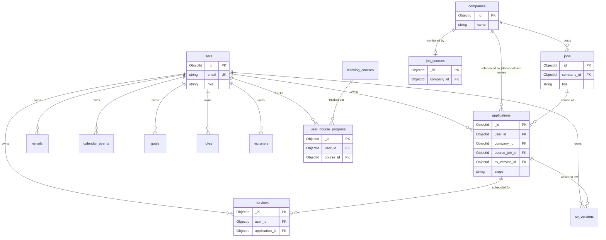

# Database Schema

> **Document type: Schema Reference.** This describes *how data is shaped
> and related* in MongoDB. For endpoint contracts, see
> [`../docs/API.md`](../docs/API.md). For system design, see
> [`../docs/ARCHITECTURE.md`](../docs/ARCHITECTURE.md).
>
> Every table below was generated from the actual Pydantic model files in
> `backend/app/models/` (via AST field extraction), not written from memory
> — if a model changes, this doc should be regenerated the same way to stay
> accurate.

## Table of Contents

- [Conventions](#conventions)
- [Entity Relationship Diagram](#entity-relationship-diagram)
- [Collections](#collections)
  - [users](#users)
  - [applications](#applications)
  - [jobs](#jobs)
  - [companies](#companies)
  - [job_sources](#job_sources)
  - [emails](#emails)
  - [cv_versions](#cv_versions)
  - [learning_courses](#learning_courses)
  - [user_course_progress](#user_course_progress)
  - [interviews](#interviews)
  - [calendar_events](#calendar_events)
  - [goals](#goals)
  - [notes](#notes)
  - [recruiters](#recruiters)
- [Index Reference](#index-reference)
- [Design Notes & Deviations](#design-notes--deviations)

## Conventions

| Convention | Detail |
|---|---|
| Primary key | Every collection has `_id: ObjectId` (Mongo default) |
| Ownership | User-owned collections carry `user_id: ObjectId` referencing `users._id` |
| Timestamps | `created_at` always present; `updated_at` present wherever the document is mutable after creation |
| Enums | Stored as plain strings (readable in `mongosh`, easy to migrate) — not Mongo's schema-validation enum type |
| Money | Stored as `salary_min`/`salary_max: number` + `currency: string`, never as a pre-formatted string like `"KES 280K"` — see [Design Notes](#design-notes--deviations) |

## Entity Relationship Diagram

## Collections

### `users`

| Field | Type | Required | Description |
|---|---|:---:|---|
| `_id` | ObjectId | ✅ | Primary key |
| `email` | EmailStr | ✅ | Unique (see [Index Reference](#index-reference)) |
| `password_hash` | string | ✅ | bcrypt hash — never the plaintext |
| `first_name`, `last_name` | string | ✅ | |
| `phone`, `location`, `title` | string | | |
| `years_experience` | int | | |
| `linkedin`, `github`, `website` | string | | |
| `summary`, `career_goal` | string | | |
| `availability`, `notice_period` | string | | |
| `salary_min`, `salary_max` | int | | See [Design Notes](#design-notes--deviations) re: money fields |
| `currency` | string | | Default `"KES"` |
| `open_to` | string[] | | e.g. `["Full-time", "Remote"]` |
| `skills` | string[] | | |
| `education` | EducationEntry[] | | Embedded: `{degree, school, year, grade}` |
| `experience_list` | ExperienceEntry[] | | Embedded: `{title, company, period, duties}` |
| `projects` | ProjectEntry[] | | Embedded: `{name, tech, description, url}` |
| `certifications` | string[] | | |
| `notifications` | NotificationPrefs | | Embedded: 6 boolean flags (jobs, deadlines, interviews, emails, learning, weekly_report) |
| `theme` | string | | `"light"` \| `"dark"` \| `"system"` |
| `two_fa_enabled` | bool | | |
| `profile_public` | bool | | |
| `role` | string | | `"user"` \| `"admin"` — baked into the JWT at login, see [`ARCHITECTURE.md`](../docs/ARCHITECTURE.md#4-request-lifecycle-authentication) |
| `created_at`, `updated_at` | datetime | ✅ | |

### `applications`

| Field | Type | Required | Description |
|---|---|:---:|---|
| `_id` | ObjectId | ✅ | Primary key |
| `user_id` | ObjectId | ✅ | → `users._id` |
| `company_id` | ObjectId | | → `companies._id` |
| `company_name` | string | ✅ | **Denormalized** from `companies.name` — see [Design Notes](#design-notes--deviations) |
| `role` | string | ✅ | |
| `stage` | string (enum) | ✅ | One of 13 pipeline stages — `Saved`, `Preparing`, `CV Optimized`, `Applied`, `Confirmed`, `Under Review`, `Assessment`, `Technical`, `HR Interview`, `Final Interview`, `Offer`, `Accepted`, `Rejected` |
| `date_applied` | date | ✅ | |
| `cv_version_id` | ObjectId | | → `cv_versions._id` |
| `cover_letter_id` | ObjectId | | *(no `cover_letters` collection built yet — field reserved)* |
| `required_skills` | string[] | | |
| `match_score`, `ats_score` | int (0–100) | | |
| `salary_range` | string | | |
| `notes` | string | | |
| `checklist` | dict[str, bool] | | Free-form key → done/not-done |
| `source_job_id` | ObjectId | | → `jobs._id`, set when created via one-click apply |
| `source_url` | string | | |
| `recruiter_email` | string | | |
| `created_at`, `updated_at` | datetime | ✅ | |

### `jobs`

| Field | Type | Required | Description |
|---|---|:---:|---|
| `_id` | ObjectId | ✅ | Primary key |
| `company_id` | ObjectId | ✅ | → `companies._id` |
| `company_name` | string | ✅ | Denormalized |
| `title` | string | ✅ | |
| `mode` | string | | `"Remote"` \| `"Hybrid"` \| `"Onsite"` |
| `level` | string | | `"Entry"` … `"Lead"` |
| `employment_type` | string | | |
| `salary_min`, `salary_max` | int | | |
| `currency` | string | | Default `"KES"` |
| `required_skills` | string[] | | |
| `match_score`, `ats_score` | int (0–100) | | |
| `posted_at` | datetime | | |
| `deadline` | date | | |
| `source_url`, `contact_email` | string | | |
| `is_hot` | bool | | Drives the "HOT" badge in the UI |
| `description` | string | | |
| `created_at`, `updated_at` | datetime | ✅ | |

### `companies`

| Field | Type | Required | Description |
|---|---|:---:|---|
| `_id` | ObjectId | ✅ | Primary key |
| `name` | string | ✅ | |
| `sector` | string | ✅ | |
| `location` | string | ✅ | |
| `ats_platform` | string | | e.g. `"Greenhouse"`, `"Workday"` — drives `job_sources.scrape_method` at seed time |
| `career_url`, `contact_email` | string | | |
| `tech_stack` | string[] | | |
| `open_roles_count` | int | | Denormalized cache, refreshed by seed/automation |
| `tier` | int | | `1` (companies) or `2` (UN/NGO) |
| `verification` | VerificationInfo | | Embedded: `{status, last_checked_at}` |
| `created_at`, `updated_at` | datetime | ✅ | |

### `job_sources`

| Field | Type | Required | Description |
|---|---|:---:|---|
| `_id` | ObjectId | ✅ | Primary key |
| `company_id` | ObjectId | ✅ | → `companies._id`, **unique** (one source per company) |
| `company_name` | string | ✅ | Denormalized, for the Source Monitor list view |
| `url` | string | ✅ | |
| `scrape_method` | string | | `"manual"` \| `"api"` \| `"html_scrape"` \| `"ats_integration"` |
| `status` | string | | `"verified"` \| `"recent"` \| `"expired"` \| `"archived"` |
| `jobs_found` | int | | |
| `last_checked_at` | datetime | ✅ | |
| `created_at` | datetime | ✅ | |

### `emails`

| Field | Type | Required | Description |
|---|---|:---:|---|
| `_id` | ObjectId | ✅ | Primary key |
| `user_id` | ObjectId | ✅ | → `users._id` |
| `from_name`, `subject` | string | ✅ | |
| `category` | string | | `"Application Received"`, `"Interview"`, `"Offer"`, ... |
| `body` | string | | |
| `received_at` | datetime | ✅ | |
| `read` | bool | | |
| `recommended_action` | string | | |
| `application_id` | ObjectId | | → `applications._id`, set once classified |
| `source` | string | | `"manual"` \| `"gmail_sync"` (sync not implemented) |
| `created_at` | datetime | ✅ | |

### `cv_versions`

| Field | Type | Required | Description |
|---|---|:---:|---|
| `_id` | ObjectId | ✅ | Primary key |
| `user_id` | ObjectId | ✅ | → `users._id` |
| `name`, `focus` | string | ✅ / | |
| `ats_score` | int (0–100) | | |
| `skills` | string[] | | |
| `file_url` | string | | Pointer into object storage — **no upload endpoint wired yet**, see [`ARCHITECTURE.md`](../docs/ARCHITECTURE.md) |
| `times_used` | int | | Incremented via `POST /cv/{id}/record-usage` |
| `last_used_at` | datetime | | |
| `created_at`, `updated_at` | datetime | ✅ | |

### `learning_courses`

*Shared catalog — not per-user.*

| Field | Type | Required | Description |
|---|---|:---:|---|
| `_id` | ObjectId | ✅ | Primary key |
| `title`, `category` | string | ✅ | |
| `level` | string | | `"Beginner"` \| `"Intermediate"` \| `"Advanced"` |
| `duration_minutes`, `lesson_count` | int | | |
| `url` | string | | |
| `linked_skill` | string | | |

### `user_course_progress`

| Field | Type | Required | Description |
|---|---|:---:|---|
| `_id` | ObjectId | ✅ | Primary key |
| `user_id` | ObjectId | ✅ | → `users._id` |
| `course_id` | ObjectId | ✅ | → `learning_courses._id`. Composite unique with `user_id` |
| `lessons_completed` | int | | |
| `status` | string | | `"not_started"` \| `"in_progress"` \| `"complete"` |
| `updated_at` | datetime | ✅ | |

### `interviews`

| Field | Type | Required | Description |
|---|---|:---:|---|
| `_id` | ObjectId | ✅ | Primary key |
| `user_id` | ObjectId | ✅ | → `users._id` |
| `application_id` | ObjectId | ✅ | → `applications._id` |
| `type` | string | | `"Technical"` \| `"HR"` \| `"Final"` \| `"Assessment"` |
| `scheduled_at` | datetime | ✅ | |
| `location` | string | | |
| `status` | string | | `"scheduled"` \| `"completed"` \| `"cancelled"` |
| `prep_checklist` | dict[str, bool] | | |
| `behavioral_questions`, `technical_questions` | string[] | | |
| `post_interview_notes` | string | | |
| `outcome` | string \| null | | `"pending"` \| `"passed"` \| `"failed"` |
| `created_at`, `updated_at` | datetime | ✅ | |

### `calendar_events`

| Field | Type | Required | Description |
|---|---|:---:|---|
| `_id` | ObjectId | ✅ | Primary key |
| `user_id` | ObjectId | ✅ | → `users._id` |
| `title` | string | ✅ | |
| `type` | string | | `"Interview"` \| `"Assessment"` \| `"Deadline"` \| `"Task"` \| `"Learning"` \| `"Reminder"` |
| `date` | date | ✅ | |
| `time`, `color` | string | | |
| `application_id` | ObjectId | | → `applications._id` |
| `created_at` | datetime | ✅ | |

### `goals`

| Field | Type | Required | Description |
|---|---|:---:|---|
| `_id` | ObjectId | ✅ | Primary key |
| `user_id` | ObjectId | ✅ | → `users._id` |
| `label`, `category` | string | ✅ | |
| `current`, `target` | int | | `current` is clamped to `[0, target]` on every increment — see [`ARCHITECTURE.md`](../docs/ARCHITECTURE.md) |
| `deadline` | date | | |
| `created_at`, `updated_at` | datetime | ✅ | |

### `notes`

*Knowledge Base.*

| Field | Type | Required | Description |
|---|---|:---:|---|
| `_id` | ObjectId | ✅ | Primary key |
| `user_id` | ObjectId | ✅ | → `users._id` |
| `title`, `category` | string | ✅ | |
| `body` | string | | |
| `tags` | string[] | | |
| `created_at`, `updated_at` | datetime | ✅ | |

### `recruiters`

*Networking contacts.*

| Field | Type | Required | Description |
|---|---|:---:|---|
| `_id` | ObjectId | ✅ | Primary key |
| `user_id` | ObjectId | ✅ | → `users._id` |
| `name` | string | ✅ | |
| `company_name`, `email`, `linkedin`, `notes` | string | | |
| `relationship_strength` | string | | `"Hot"` \| `"Warm"` \| `"Cold"` \| `"New"` |
| `last_contacted_at` | datetime | | |
| `created_at`, `updated_at` | datetime | ✅ | |

## Index Reference

Extracted directly from `backend/app/database/mongodb.py`'s `ensure_indexes()`.

| Collection | Index | Type |
|---|---|---|
| `users` | `email` | unique |
| `applications` | `user_id, stage` | compound |
| `applications` | `user_id, date_applied desc` | compound |
| `applications` | `company_name, role` | text |
| `jobs` | `title, company_name` | text |
| `jobs` | `match_score desc` | single |
| `jobs` | `company_id` | single |
| `companies` | `name, sector` | text |
| `emails` | `user_id, read` | compound |
| `emails` | `user_id, received_at desc` | compound |
| `notes` | `user_id, category` | compound |
| `notes` | `title, body` | text |
| `calendar_events` | `user_id, date` | compound |
| `recruiters` | `user_id, company_name` | compound |
| `cv_versions` | `user_id, last_used_at desc` | compound |
| `learning_courses` | `category` | single |
| `user_course_progress` | `user_id, course_id` | compound, **unique** |
| `interviews` | `user_id, scheduled_at` | compound |
| `interviews` | `application_id` | single |
| `goals` | `user_id, deadline` | compound |
| `job_sources` | `company_id` | single, **unique** |
| `job_sources` | `status` | single |

## Design Notes & Deviations

1. **Money as numbers, not strings.** `salary_min`/`salary_max`/`currency`
   are separate typed fields, never a pre-formatted string like
   `"KES 280 - 380K"` — that can't be sorted or aggregated in Mongo.
2. **Denormalize on purpose, sparingly.** `applications.company_name` and
   `jobs.company_name` are intentionally duplicated from `companies.name`
   — application/job lists are read far more often than companies change,
   and it avoids a `$lookup` on every list render. Everywhere else, prefer
   references.
3. **Every user-owned collection carries `user_id` and is indexed on it
   first.** This is what makes a future multi-user/permissions model a
   query-filter change, not a schema rewrite.
4. **Text indexes match what the frontend actually searches.** Job
   title/company, company name/sector, application company/role, and note
   title/body all have `$text` indexes backing the search bars in the
   corresponding pages — not a coincidence, the indexes were added to
   support those specific query patterns.
5. **`cover_letter_id` on `applications` has no matching collection yet** —
   reserved for when cover letters get their own persisted history instead
   of being generated fresh each time via `POST /ai/cover-letter`.
