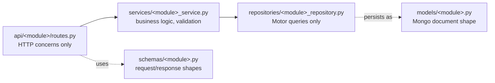
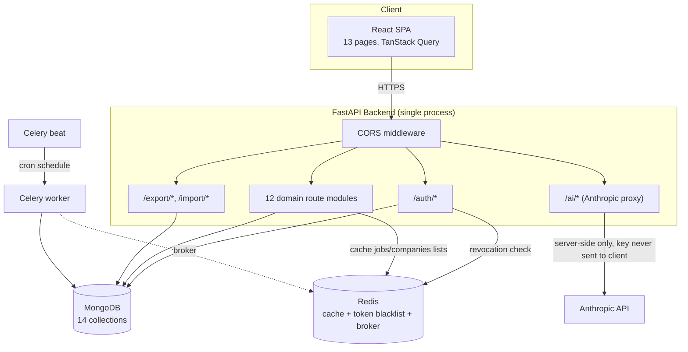
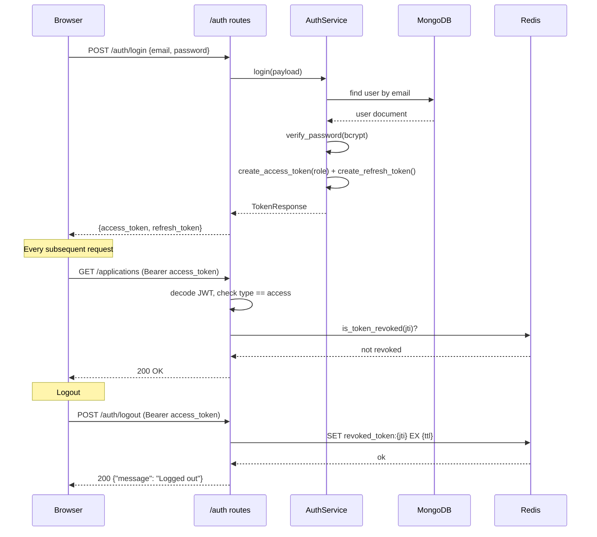
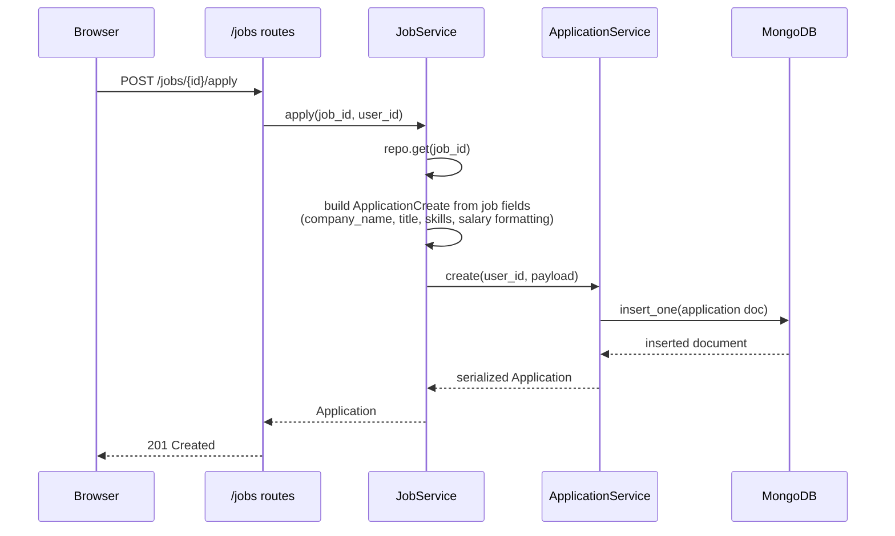
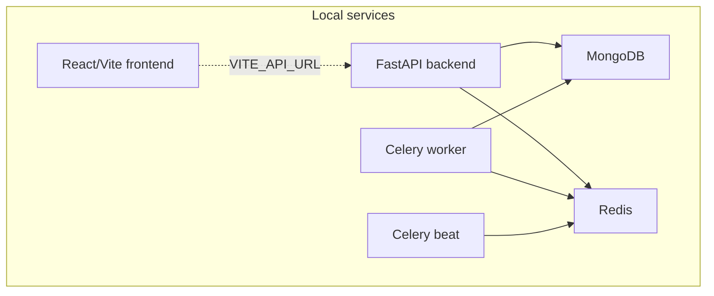

# Architecture

> **Document type: Architecture Reference.** This describes *how the system
> is built* — components, data flow, and deployment. For *what the API
> does*, see [`API.md`](API.md). For *how data is shaped*, see
> [`../database/SCHEMA.md`](../database/SCHEMA.md). For setup instructions,
> see the [root README](../README.md).

## Table of Contents

- [1. Overview](#1-overview)
- [2. Layered Backend Design](#2-layered-backend-design)
- [3. System Diagram](#3-system-diagram)
- [4. Request Lifecycle: Authentication](#4-request-lifecycle-authentication)
- [5. Request Lifecycle: One-Click Apply](#5-request-lifecycle-one-click-apply)
- [6. Caching Strategy](#6-caching-strategy)
- [7. Background Jobs](#7-background-jobs)
- [8. Deployment Topology](#8-deployment-topology)
- [9. Design Decisions & Trade-offs](#9-design-decisions--trade-offs)

---

## 1. Overview

Denno is a layered monolith: one FastAPI process serving 13 resource
modules plus auth, backed by MongoDB, with Redis for caching/token
revocation/Celery brokering, and a React SPA frontend. It is not
microservices — every module lives in the same codebase and deploys as a
single process — but each module is internally layered so it *could* be split
out later without a rewrite.

## 2. Layered Backend Design

Every module (Applications, Jobs, Companies, ...) follows the same five-file
pattern, strictly one-directional:

| Layer | Owns | Never does |
|---|---|---|
| `routes.py` | HTTP status codes, auth dependency wiring, request/response models | Direct DB access, business rules |
| `service` | Validation, cross-module composition (e.g. `JobService` calling into `ApplicationService`), serialization | Raw Motor query syntax |
| `repository` | All `db[collection].find_one(...)` etc. | Business rules, HTTP concerns |
| `schema` | Pydantic models exposed over HTTP | Storage concerns |
| `model` | Pydantic model matching what's actually stored in Mongo | Wire-format concerns |

This is enforced, not just documented — `scripts/check_wiring.py` statically
verifies every `route → service` and `service → repository` call resolves
to a real method on the target class, and fails CI if it doesn't.

## 3. System Diagram

## 4. Request Lifecycle: Authentication

## 5. Request Lifecycle: One-Click Apply

This is the one genuinely cross-module flow in the codebase — `JobService`
composes `ApplicationService` directly rather than going through HTTP:

## 6. Caching Strategy

| Endpoint | TTL | Invalidation |
|---|---|---|
| `GET /jobs` | 60s | SCAN + DELETE on any `POST`/`PATCH`/`DELETE /jobs` |
| `GET /companies` | 300s | SCAN + DELETE on any `POST`/`PATCH`/`DELETE /companies` |

Both cache reads/writes are wrapped in `try/except` — if Redis is
unreachable, the endpoint falls back to a live Mongo read rather than
failing the request. Cache keys are built from the full query-parameter
tuple (`q`, filters, pagination), so different search results never collide.

## 7. Background Jobs

| Task | Schedule | What it does |
|---|---|---|
| `app.tasks.job_sources.verify_all_sources` | Daily, 03:00 UTC | Re-checks every Job Source's status (currently simulated — see [API.md](API.md#job-sources)) |
| `app.tasks.reports.generate_weekly_reports` | Weekly, Monday 06:00 UTC | Computes application analytics per user (logs only — no email/persistence wired up yet) |

Each task opens its **own** short-lived Mongo connection rather than sharing
the FastAPI process's pool, since Celery workers are separate OS processes.

## 8. Deployment Topology

The app is expected to run with local MongoDB and Redis services plus the
backend, worker, beat, and frontend processes started separately.

## 9. Design Decisions & Trade-offs

| Decision | Why | Trade-off accepted |
|---|---|---|
| Motor (async) over PyMongo (sync) | FastAPI is async end-to-end; a sync driver would block the event loop | Slightly more ceremony per query (`await` everywhere) |
| Service-layer composition (`JobService` → `ApplicationService`) instead of HTTP-calling-itself | Avoids a service calling its own API over HTTP, which is slower and fragile | Services must be constructed with the same `db` handle — enforced by convention, checked by `check_wiring.py` |
| `jti`-based token revocation instead of a full session store | Stateless JWTs stay stateless for 99% of requests; only logout touches Redis | A stolen *refresh* token issued before rotation isn't independently revocable without extending this further |
| Denormalized `company_name` on `applications`/`jobs` | Read-heavy list views shouldn't need a `$lookup` on every render | Company renames require a backfill (not automated yet) |
| CSV/JSON export composes existing services, not raw Mongo dumps | Every export goes through the same Pydantic validation as a normal read | Slightly slower than a raw collection dump for very large exports (not a concern at current scale) |
